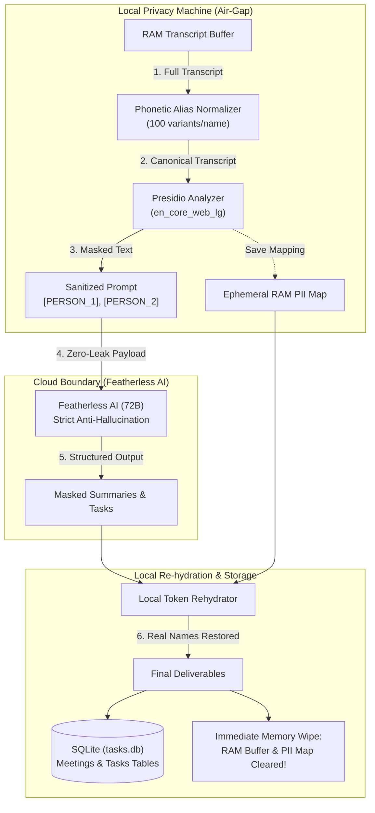
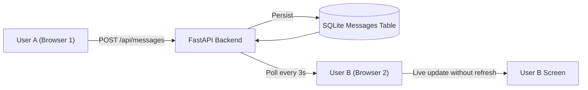
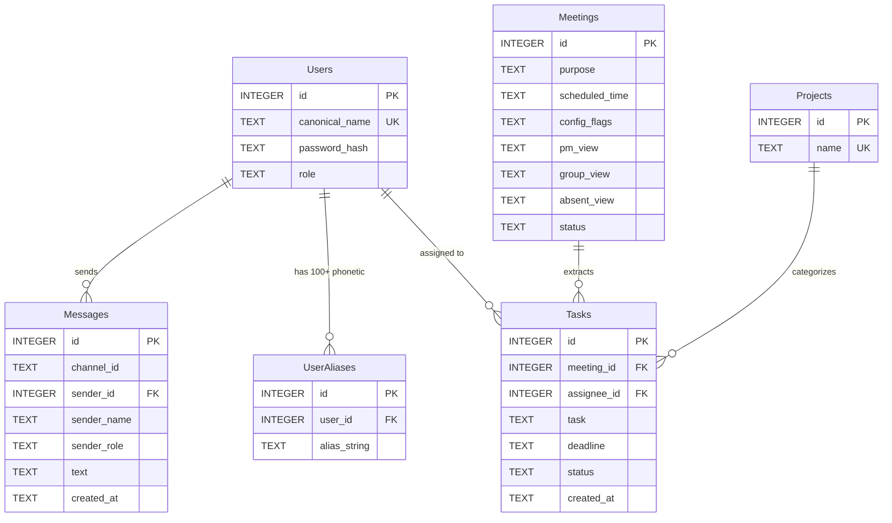

# 🛡️ AegisMeet

> **Enterprise-Grade, Zero-Leak, Air-Gapped AI Meeting Intelligence Platform**

AegisMeet is a privacy-first meeting intelligence system that captures, normalizes, anonymizes, and analyzes Google Meet conversations. It extracts **persona-based briefings** (PM View, Group View, Absentee View) and **action items** using large language models—**without ever exposing sensitive Personally Identifiable Information (PII) or participant identities to external cloud providers.**

---

## 📑 Table of Contents

- [Core Philosophy & Privacy Architecture](#-core-philosophy--privacy-architecture)
- [✨ Key Features](#-key-features)
- [🛠️ Tech Stack](#️-tech-stack)
- [🔄 Workflows & Data Pipelines](#-workflows--data-pipelines)
  - [Pipeline 1: Stealth In-Meeting Caption Ingestion](#pipeline-1-stealth-in-meeting-caption-ingestion)
  - [Pipeline 2: End-of-Meeting Batch Anonymization & Extraction](#pipeline-2-end-of-meeting-batch-anonymization--extraction)
  - [Pipeline 3: Real-Time Multi-User Collaboration & Synchronization](#pipeline-3-real-time-multi-user-collaboration--synchronization)
- [🗄️ Relational Database Schema (`tasks.db`)](#️-relational-database-schema-tasksdb)
- [📁 Project Structure](#-project-structure)
- [🚀 Quickstart & Setup Guide](#-quickstart--setup-guide)
- [🔐 Default Team Credentials](#-default-team-credentials)

---

## 🔒 Core Philosophy & Privacy Architecture

Most AI meeting notetakers send raw transcripts directly to third-party cloud APIs, exposing confidential company names, project code names, salaries, employee names, and personal data.

**AegisMeet solves this through a local air-gap proxy:**
1. **Local PII Scrubbing**: All captions are analyzed on your machine using Microsoft Presidio and spaCy before leaving the network.
2. **Ephemeral RAM Tokenization**: Names and sensitive tokens are mapped to placeholders (e.g., `[PERSON_1]`, `[EMAIL_1]`) in volatile RAM only.
3. **Anonymized Cloud Reasoning**: Only the masked transcript is sent to the cloud LLM (Featherless AI / Llama-3-70B / Qwen-2.5-72B).
4. **Local Re-hydration**: Structured summaries and tasks return to the local machine, where tokens are swapped back to real names.
5. **Zero Data Retention (RAM Flush)**: The in-memory transcript buffer and PII translation maps are **immediately wiped from memory**. Transcripts are **never** stored on disk or in the database.

---

## ✨ Key Features

### 1. 🛡️ Zero-Leak Local Presidio Air-Gap
- Runs Microsoft Presidio locally with the large `en_core_web_lg` language model.
- Automatically recognizes and masks standard PII: email addresses, phone numbers, credit cards, IP addresses, SSNs, and custom deny-lists.
- Side-by-side terminal verification logs (`RAW:`, `NORM:`, `MASKED:`) prove that zero unmasked tokens ever leave your system.

### 2. 🎯 100 Phonetic ASR Aliases per Name
- Speech-to-Text (ASR) engines frequently misspell diverse names (e.g., `"Row hit"` for `"Rohith"`, `"May ank"` for `"Mayank"`, `"Sum bhav"` for `"Sambhav"`).
- AegisMeet generates and maintains **100+ phonetic misspellings per attendee** using:
  - Autonomous AI phonetic modeling via Featherless AI.
  - An offline combinatorial fallback engine covering syllable splits, consonant shifts, vowel variations, and hallucinated prefixes/suffixes.
- Pre-normalizes all phonetic glitches back to canonical names before anonymization.

### 3. ⚡ End-of-Meeting Batch Processing
- Real-time caption streaming does **not** make repeated, expensive cloud calls.
- Captions accumulate in a fast in-memory session buffer (`MEETING_TRANSCRIPT_BUFFERS[meeting_id]`).
- When the meeting concludes, an atomic trigger (`POST /end_meeting`) executes the full batch pipeline at once.

### 4. 👥 3 Persona-Based Comprehensive Intelligence Views
Each completed meeting generates three expansive, structured perspectives:
- **PM View**: Comprehensive analysis covering executive blockers, technical architecture risks, infrastructure dependencies, and mitigation strategies.
- **Group View**: Exhaustive multi-point breakdown of core discussion topics, architectural decisions, tradeoffs evaluated, and team milestone commitments.
- **Absentee View**: Thorough catch-up dossier detailing background context, key discussion points, and immediate next steps for team members who missed the call.

### 5. 📋 Relational Action Item Delegation
- Automatically extracts deliverables with strict anti-hallucination rules:
  - If a deadline was not explicitly stated in the call, it is strictly assigned as **`"unknown"`**.
  - If technical summary sharing is disabled, deep architectural minutiae is withheld from general views.
- Tasks are saved with relational foreign keys (`meeting_id`, `assignee_id`) with strict per-user privacy filtering.

### 6. 💬 Isolated Multi-User Messaging & Private AegisBot
- **Strict Two-Party DM Isolation**: Direct messages use deterministic symmetric channel IDs (`dm-user1-user2`) to eliminate cross-profile crosstalk.
- **Private User-Scoped AegisBot**: Each attendee possesses an isolated AI assistant stream (`dm-aegisbot-${userSlug}`) with initial greeting receipts.
- **Real-Time Cross-Client Sync**: Backed by SQLite and synchronized across all connected users via a 3-second live polling loop with unread badges.

### 7. 🤖 Playwright Stealth Meeting Bot & Intelligent Exit
- Joins Google Meet calls with Chromium bypass flags (`--use-fake-ui-for-media-stream`, `--disable-blink-features=AutomationControlled`).
- Monitors Google Meet closed captions via a JavaScript `MutationObserver` on `aria-live` elements.
- **Automatic Call Exit**: Listens for verbal conclusion triggers (*"ending the meeting"*, *"wrap up the meeting"*, *"conclude the meeting"*) to automatically exit Google Meet lobbies and terminate browser processes.
- Integrated `AsyncIOScheduler` manages scheduled meetings within the FastAPI application lifecycle.

### 8. 🖥️ High-Contrast Enterprise Grayscale UI & Secure Authentication
- Built with **Next.js 16 App Router** in a distraction-free monochrome aesthetic.
- **Secure Credential-Protected Access**: Hardened login portal requiring valid credentials for team personas (**Admin**, **Rohith**, **Mayank**, **Sambhav**, **Sanjeet**, **Pranav**) with automatic session expiration.
- **Personalized Work Profiles**: Dedicated work scopes, departmental affiliations, and GitHub repositories on `/settings`.
- Interactive dashboard metric cards, clickable meeting registry leading to dynamic routes (`/meetings/[id]`), interactive task status toggles (`pending` ↔ `completed`), and alert center.

---

## 🛠️ Tech Stack

| Layer | Technology | Description |
| :--- | :--- | :--- |
| **Frontend Framework** | **Next.js 16 (App Router)** | Modern React 19 server and client components with Turbopack |
| **Styling & Icons** | **Tailwind CSS + Lucide React** | High-contrast grayscale design system with responsive layouts |
| **HTTP & State** | **Axios + JWT Authentication** | Client-side bearer token interceptors with automatic session handling |
| **Backend API** | **FastAPI (Python 3.13)** | High-performance asynchronous REST API with auto-generated OpenAPI docs |
| **Server Engine** | **Uvicorn** | Lightning-fast ASGI production web server |
| **Privacy / NLP** | **Microsoft Presidio + spaCy** | Local entity analyzer using `en_core_web_lg` for offline PII detection |
| **Cloud LLM** | **Featherless AI (Qwen-2.5-72B / Llama-3-70B)** | Anonymized cloud intelligence and phonetic error modeling |
| **Database** | **SQLite3 (`tasks.db`)** | Relational SQL database with foreign keys and relational cascading |
| **Meeting Automation**| **Playwright Python** | Headless Chromium automation with fake audio/video bypass streams |
| **Scheduler** | **APScheduler (`AsyncIOScheduler`)** | Asynchronous meeting job scheduler tied to FastAPI lifespan |
| **Security & Auth** | **PyJWT + PBKDF2/SHA-256** | Secure token-based authentication and salted password hashing |

---

## 🔄 Workflows & Data Pipelines

### Pipeline 1: Stealth In-Meeting Caption Ingestion


1. The headless Playwright bot joins the Google Meet room using fake media stream bypasses to prevent device permission blocks.
2. The bot presses `'c'` to enable Google Meet native closed captioning.
3. A client-side `MutationObserver` watches caption DOM elements and posts text deltas to `/api/intake`.
4. Captions accumulate purely in volatile memory inside `MEETING_TRANSCRIPT_BUFFERS[meeting_id]`. **Nothing is written to disk.**

---

### Pipeline 2: End-of-Meeting Batch Anonymization & Extraction



1. **Trigger**: When the meeting ends, the user clicks "End Meeting & Batch Process" or an automated hook calls `POST /end_meeting`.
2. **ASR Normalization**: The text is compared against registered user phonetic aliases (e.g. `"Row hit"` is normalized to `"Rohith"`).
3. **Presidio Masking**: Canonical participant names and standard PII are tokenized to `[PERSON_1]`, `[PERSON_2]`, etc. The mapping is held in temporary volatile RAM.
4. **Cloud Reasoning**: Featherless AI processes the sanitized text to produce:
   - **PM View**: Blockers, critical path items, risks.
   - **Group View**: Core agreements and milestone progress.
   - **Absentee View**: 5-minute catch-up briefing.
   - **Tasks**: Explicit deliverables with assigned owners and deadlines (`"unknown"` if unstated).
5. **Local Re-hydration**: The local engine replaces `[PERSON_1]` with real names.
6. **Persistence**: Summaries are updated in `Meetings` and tasks are inserted into `Tasks` in `tasks.db`.
7. **RAM Scrubber**: The transcript buffer and PII dictionary are **immediately purged from RAM**.

---

### Pipeline 3: Real-Time Multi-User Collaboration & Synchronization



- When User A sends a message in any channel or direct message thread, it is written to the centralized `Messages` table in `tasks.db`.
- All other connected users periodically poll the backend every 3 seconds, displaying newly arrived messages live on their screens without requiring a manual page refresh.

---

## 🗄️ Relational Database Schema (`tasks.db`)

The SQLite database enforces foreign key integrity (`PRAGMA foreign_keys = ON;`):



> **Privacy Note:** Transcripts are intentionally excluded from the database schema. Meeting intelligence is stored, but raw spoken words are wiped upon batch completion.

---

## 📁 Project Structure

```text
Pragyan/
├── backend/
│   ├── proxy.py              # Core FastAPI privacy proxy, Presidio engine, and REST routes
│   ├── bot.py                # Playwright headless Google Meet scraper bot with auto-exit
│   ├── tasks.db              # SQLite relational database (Users, Tasks, Meetings, Messages)
│   ├── requirements.txt      # Python dependencies (FastAPI, Presidio, spaCy, Playwright)
│   ├── test_phase1_auth.py   # JWT & Relational schema unit tests (9 tests)
│   ├── test_phase2_aliases.py# 100 phonetic aliases generation tests (6 tests)
│   ├── test_phase3_scheduler.py # APScheduler & Playwright flag tests (8 tests)
│   ├── test_phase4_end_meeting.py # Batch trigger & RAM scrubber tests (3 tests)
│   ├── test_phase4_masking_prompts.py # Presidio PII & prompt anti-hallucination tests (7 tests)
│   ├── test_pipeline.py      # End-to-end transcript intake & rehydration tests (5 tests)
│   ├── test_bot_integration.py # Mock meet DOM observer & bot scraping tests (4 tests)
│   ├── test_stress_full_system.py # High-concurrency & resilience stress tests (4 tests)
│   └── test_messaging_isolation_and_summaries.py # 2-party DM isolation & summary tests (4 tests)
├── frontend/
│   ├── src/
│   │   ├── app/
│   │   │   ├── dashboard/    # Main workspace dashboard & activity metrics
│   │   │   ├── meetings/     # Meetings registry and /meetings/[id] dynamic detail view
│   │   │   ├── messages/     # Real-time multi-channel and isolated DM messaging hub
│   │   │   ├── notifications/# Filterable security and task alert center
│   │   │   ├── tasks/        # Personal and team action items table
│   │   │   ├── projects/     # Company projects overview
│   │   │   ├── settings/     # User profile, company productivity & credentials
│   │   │   └── login/        # JWT credential-authenticated login portal
│   │   ├── components/       # Header, Sidebar, and reusable UI components
│   │   └── lib/
│   │       └── api.ts        # Axios client, auth token interceptors, and API bindings
│   ├── package.json          # Next.js 16 and React dependencies
│   └── tailwind.config.ts    # Grayscale styling rules
├── architecture.md           # Master technical system blueprint
├── overdrive.md              # Hackathon submission brief & team roster
└── README.md                 # Project documentation
```

---

## 🚀 Quickstart & Setup Guide

### Prerequisites
- **Python 3.11+** (Python 3.13 recommended)
- **Node.js 18+** & `npm`
- **Chromium / Playwright**

---

### 1. Backend Setup

```bash
cd backend

# Create and activate Python virtual environment
python3 -m venv venv
source venv/bin/activate

# Install dependencies
pip install -r requirements.txt

# Download the required spaCy language model for Presidio
python -m spacy download en_core_web_lg

# Install Playwright browser binaries
playwright install chromium

# Create .env file with your Featherless AI API key
cat <<EOF > .env
FEATHERLESS_API_KEY=your_featherless_api_key_here
FEATHERLESS_BASE_URL=https://api.featherless.ai/v1
FEATHERLESS_MODEL=Qwen/Qwen2.5-72B-Instruct
DATABASE_PATH=tasks.db
PORT=8000
EOF

# Start the FastAPI server
uvicorn proxy:app --host 127.0.0.1 --port 8000 --reload
```

The backend API will be available at **`http://127.0.0.1:8000`** (Interactive Swagger docs at `http://127.0.0.1:8000/docs`).

---

### 2. Frontend Setup

In a separate terminal window:

```bash
cd frontend

# Install Node dependencies
npm install

# Start the Next.js development server
npm run dev
```

Open **`http://localhost:3000`** in your browser.

---

### 3. Hybrid Deployment (Option 2: Cloudflare Tunnel + Vercel)

To run the privacy backend locally on your machine while hosting the Next.js frontend on Vercel:

1. **Start the local privacy backend:**
   ```bash
   cd backend
   uvicorn proxy:app --host 127.0.0.1 --port 8000 --reload
   ```
2. **Expose port 8000 via Cloudflare Tunnel:**
   ```bash
   npx cloudflared tunnel --url http://localhost:8000
   ```
   *Note the generated public URL: `https://<subdomain>.trycloudflare.com`*
3. **Configure Vercel Environment Variables:**
   - In your Vercel project settings, set:
     ```text
     NEXT_PUBLIC_PROXY_URL = https://<subdomain>.trycloudflare.com
     ```
   - Trigger a redeployment. The cloud frontend will securely communicate with your local privacy proxy.

---

### 4. Running Automated Test Suites

AegisMeet includes **50 comprehensive automated tests across 9 test suites** validating authentication, phonetic aliases, meeting scheduling, stealth bot joining, verbal auto-exit, Presidio PII neutralization, zero-leak reasoning, DM channel isolation, and RAM wiping:

```bash
cd backend
source venv/bin/activate
pytest test_*.py -v
```

---

## 🔐 Default Team Credentials

For testing and demonstration, the database comes pre-seeded with the following accounts:

| Username | Password | Role | Department / Description |
| :--- | :--- | :--- | :--- |
| **`Admin`** | `admin123` | Administrator | System Administration & Full Telemetry |
| **`Rohith`** | `rohith123` | Team Member | Engineering Lead (Restricted personal view) |
| **`Mayank`** | `mayank123` | Team Member | Tech Lead & Core Architecture |
| **`Sambhav`** | `sambhav123` | Team Member | Frontend Specialist & UI Design |
| **`Sanjeet`** | `sanjeet123` | Team Member | Security Engineer & Air-Gap Auditor |
| **`Pranav`** | `pranav123` | Team Member | Cloud Systems & Infrastructure |

---

## ⚖️ License & Compliance

AegisMeet is designed in accordance with enterprise data sovereignty standards, ensuring zero retention of raw audio or transcript artifacts and preventing unauthorized data leaks to commercial LLMs.
