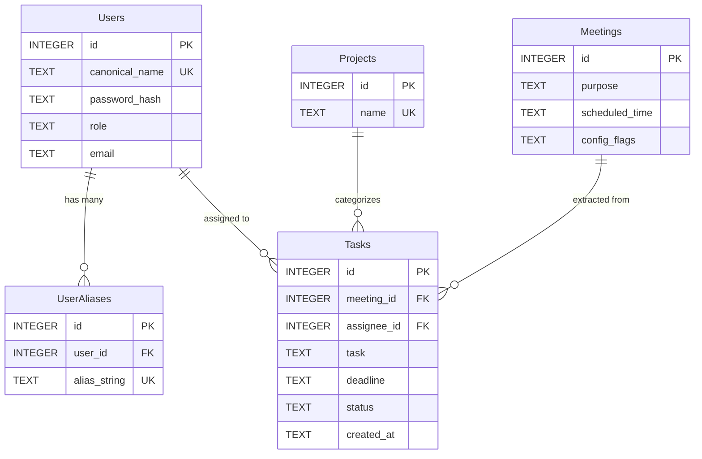

# AegisMeet: Architecture & System Blueprint (Production Source of Truth)

**SYSTEM STATUS:** Production Master Overhaul Complete (Phases 1–6 Implemented & Verified).
**AGENT DIRECTIVE:** This document is the absolute source of truth for the AegisMeet system. Any updates to data schemas, privacy boundaries, or API contracts must be documented here first.

---

## 1. System Blueprint & The North Star

### Mission
Build an enterprise-grade, air-gapped, privacy-preserving AI meeting intelligence platform. AegisMeet automates meeting administration, persona-based summaries (PM, Group, Absentee), and task delegation via cloud LLMs without ever leaking sensitive Personally Identifiable Information (PII) or un-anonymized attendee names to external servers.

### High-Level Data Flow
```mermaid
flowchart TD
    subgraph Client ["Client & Meeting Intake Layer"]
        A1["Google Meet Call"] -->|Live Captions| B1["Playwright Stealth Bot / In-Tab Scraper"]
        B1 -->|POST /api/intake| C1["FastAPI Ingestion Endpoint"]
    end

    subgraph Normalization ["Phase 2 & 4: Normalization & Identity Resolution"]
        C1 --> D1["Dynamic ASR Alias Normalizer"]
        D1 -->|Rewrites glitches: 'Row hit' -> 'Rohith'| E1["Canonical Meeting Transcript"]
        E1 --> F1["Presidio Dynamic PatternRecognizer"]
        F1 -->|Tokenizes canonical participants to [PERSON_X]| G1["Sanitized Masked Transcript"]
        F1 -.->|Ephemeral RAM Map| H1["RAM PII Dictionary"]
    end

    subgraph Cloud ["Air-Gapped External Cloud Boundary"]
        G1 -->|Strict Anonymized Payload| I1["Cloud LLM (Featherless AI / Llama-3-70B)"]
        I1 -->|JSON Output: Tasks with [PERSON_X] & 'unknown' Deadlines| J1["Masked LLM Result"]
    end

    subgraph Rehydration ["Local Re-hydration & Relational Persistence"]
        J1 --> K1["Local Re-hydration Engine"]
        H1 --> K1
        K1 -->|Replaced [PERSON_X] with Real Names| L1["Real Task & Summary Entities"]
        L1 -->|Foreign Key Constraints| M1["SQLite Relational DB (tasks.db)"]
        L1 -->|Real-Time Telemetry| N1["Audit Logs & Webhook Dispatch"]
    end

    subgraph Presentation ["Phase 5: Next.js Multi-Page UI"]
        M1 -->|Strict User ID Isolation| O1["Next.js Multi-Page Grayscale Dashboard"]
        O1 --> P1["My Tasks (/tasks)"]
        O1 --> Q1["Active Projects (/projects)"]
        O1 --> R1["Meeting Hub (/meetings)"]
        O1 --> S1["Account & Work Profile (/settings)"]
    end
```

---

## 2. Relational Database Architecture (`tasks.db`)

The SQLite database operates with strict foreign key integrity enabled on every connection (`PRAGMA foreign_keys = ON;`).



### Table Definitions & Privacy Guarantees
1. **`Users`**: Holds canonical user identities, PBKDF2/SHA-256 hashed passwords, company email addresses, and roles (`admin` or `user`).
2. **`Projects`**: Categorizes enterprise initiatives (`Workspace App`, `Auth System`, `UI Kit`, `Project A`).
3. **`Meetings`**: Stores meeting objectives, scheduled timestamps, and JSON-encoded session configuration flags (`expected_participants`, `share_technical_summary`). Transcripts are **NEVER** persisted.
4. **`Tasks`**: Stores actionable deliverables linked to `meeting_id` and `assignee_id`. Strictly filtered by `assignee_id` so regular users can only access their own tasks.
5. **`UserAliases`**: Maps foreign key `user_id` to phonetic variations and ASR error patterns. Cascades on user deletion.

---

## 3. Autonomous ASR Alias Generator & Error Modeling

Automated Speech Recognition (ASR) systems frequently mishear Indian and multicultural names during live calls (e.g. `"Row hit"` for `"Rohith"`, `"May ank"` for `"Mayank"`). AegisMeet solves this proactively:

1. **Autonomous LLM Generation (`generate_phonetic_aliases`)**:
   - Calls Featherless AI (`meta-llama/Meta-Llama-3-70B-Instruct`) with the mandated prompt:
     > *"You are an expert in speech-to-text error modeling. Given the canonical name \"[NAME]\", generate 15 common phonetic misspellings, transcription errors, or separated syllables that an automated speech recognition (ASR) system might produce in a meeting. Output strictly a JSON array of strings."*
2. **Heuristic Fallback Generator (`generate_fallback_aliases`)**:
   - Deterministic offline algorithm generating at least 15 phonetic variants covering syllable splits (hyphens/spaces), vowel shifts (`ee`/`i`, `o`/`ou`), consonant substitutions (`th`/`t`, `k`/`c`), and suffix drops. Ensures user creation never blocks even during network outages.
3. **Admin Registration Hook (`save_user_aliases_to_db`)**:
   - Automatically invoked on `POST /users`: populates `UserAliases` with the canonical name, first name, and 15 phonetic variants.
4. **Pre-Masking Normalization (`normalize_transcript_aliases`)**:
   - Scans incoming captions in descending length order and rewrites all registered phonetic glitches into canonical names before passing text to Presidio.

---

## 4. Privacy Engine & Dynamic Presidio Boundary

1. **Session-Specific Deny-List (`mask_transcript`)**:
   - Constructs an ad-hoc Microsoft Presidio `PatternRecognizer` strictly targeting the canonical names of `expected_participants` declared for the meeting.
   - Assigned exact confidence `1.0`, ensuring attendee names are reliably converted to `[PERSON_1]`, `[PERSON_2]`, etc.
2. **Ephemeral RAM Storage**:
   - Reversible mapping `{"[PERSON_1]": "Rohith", "[PERSON_2]": "Mayank"}` is held solely in volatile memory during the active LLM request lifecycle.
   - Aggressively wiped once local re-hydration and database persistence complete.
3. **Side-by-Side X-Ray Logging**:
   - Terminal logs display `RAW:`, `NORM:`, and `MASKED:` strings side-by-side to guarantee verifiable air-gap compliance.

---

## 5. Context-Aware LLM Prompting & Anti-Hallucination Rules

1. **Context Ingestion (`build_system_prompt`)**:
   - Injects `meeting_purpose` directly into the system prompt to anchor reasoning context.
2. **Strict `"unknown"` Deadline Rule**:
   - If a participant assigns a task without explicitly stating a due date (e.g., "Rohith will fix the backend"), the model and local parsing rules **mandate** outputting `"unknown"`. Fabricated dates are strictly prohibited.
3. **Technical Granularity Filter**:
   - When `share_technical_summary` is `false`, deep architecture specifications, internal database schemas, and stack traces are filtered out, producing an executive-level summary suitable for non-technical stakeholders.

---

## 6. Bot Intake Scraper & Lifespan Scheduler

1. **Browser Stealth & Bypass Flags ([`backend/bot.py`](backend/bot.py))**:
   - Flags: `--use-fake-ui-for-media-stream`, `--use-fake-device-for-media-stream`, `--disable-blink-features=AutomationControlled`, `--lang=en-US`.
   - Automatically bypasses Chrome camera/mic permissions and avoids anti-bot detections.
2. **DOM Caption Scraper & `aria-live` MutationObserver**:
   - Locates and clicks `[aria-label="Turn on captions"]` (CC) with keyboard shortcut `'c'` fallback.
   - Attaches a `MutationObserver` targeting `[aria-live="polite"]`, `[aria-live="assertive"]`, and caption containers (`div[jsname="YSxPtf"]`, `div.a4bIc`).
   - Streams text via `window.aegisMutationBridge` to `POST /api/intake`.
3. **In-Tab Bookmarklet (`/aegis-meet.js`)**:
   - Zero-install fallback script injects directly into active Meet tabs to bypass host guest-admit locks.
4. **FastAPI Lifespan APScheduler**:
   - `AsyncIOScheduler` boots inside the FastAPI lifespan context manager.
   - Schedules automated meeting bot execution via `POST /schedule` with SQLite meeting persistence.

---

## 7. Next.js Multi-Page Frontend & Enterprise UI

1. **Axios Bearer Interceptor ([`frontend/src/lib/api.ts`](frontend/src/lib/api.ts))**:
   - Request interceptor automatically attaches `Authorization: Bearer ${token}` from `localStorage`.
   - Response interceptor flushes expired tokens and redirects to `/login` upon 401s.
2. **High-Contrast Grayscale Dashboard Layout**:
   - **Persistent Sidebar ([`Sidebar.tsx`](frontend/src/components/Sidebar.tsx))**:
     - Brand logo with Shield icon and `AegisMeet` title linking directly to `/dashboard`.
     - Navigation links: `Dashboard`, `My Tasks`, `Projects`, `Meetings`, `Messages`, `Notifications`, `Settings`.
     - Bottom `Logout` action.
   - **Header ([`Header.tsx`](frontend/src/components/Header.tsx))**:
     - Air-Gapped Zero-Leak Shield status indicator.
     - Functional `Notification` dropdown with live badge counter and "Mark Read" control.
     - Functional `User Profile` dropdown with name, company email, role badge, quick links, and logout.
   - **Dashboard Canvas**:
     - Welcome header: "Welcome section", "Nice to see you again, {user.name}".
     - 4 Dark Grayscale Metric Cards: Tasks Completed (128 / +12%), Active Projects (12 / 2 due today), Messages (34 / 5 unread), Productivity (82% / +5% improvement).
     - Activity Overview Card: Custom SVG line chart (`ActivityChart.tsx`) displaying exact reference datapoints (`Mon: 30` to `Sun: 65`).
     - Recent Tasks Card: High-contrast table with colored status dots (`Completed`, `In Progress`, `Pending`).
     - Meeting Launcher Drawer: Quick modal for immediate or scheduled bot execution.
3. **Dedicated Sub-pages**:
   - `/tasks`: Filterable task table (All, Pending, Completed), task creation modal, inline status toggle, and deletion.
   - `/projects`: Active enterprise projects and linked deliverables.
   - `/meetings`: Stealth bot status monitor, scheduled sessions table, and manual transcript tester.
   - `/settings`: Enterprise Identity Tier and customizable **Work Profile & Engineering Productivity Domain** (Job Title, Department, linked GitHub Repository, Job Description, and productivity metrics).
   - `/login`: Clean password-verified login portal without demo account bypass buttons.

---

## 8. Complete API Specifications

| Method | Endpoint | Auth Required | Description |
| :--- | :--- | :--- | :--- |
| `POST` | `/api/login` | None | Authenticates canonical name & password; returns JWT Bearer token |
| `GET` | `/api/me` | Bearer Token | Returns authenticated user profile and permissions |
| `POST` | `/api/users` | Admin Only | Registers new user and triggers autonomous alias generation |
| `GET` | `/api/users` | Admin Only | Lists all registered enterprise users |
| `GET` | `/api/tasks` | Bearer Token | Returns tasks (strictly filtered by `assignee_id` for regular users) |
| `POST` | `/api/tasks` | Bearer Token | Creates new task assigned to user or project |
| `PATCH`| `/api/tasks/{id}`| Bearer Token | Updates task completion status (`completed` / `pending`) |
| `DELETE`|`/api/tasks/{id}`| Bearer Token | Deletes task record |
| `GET` | `/api/projects` | Bearer Token | Lists enterprise projects |
| `POST` | `/api/projects` | Bearer Token | Registers new project |
| `GET` | `/api/meetings` | Bearer Token | Lists meetings (strictly filtered by user involvement) |
| `POST` | `/join` | Bearer Token | Triggers immediate Playwright bot join to Google Meet |
| `POST` | `/schedule` | Bearer Token | Schedules future meeting bot execution via APScheduler |
| `GET` | `/api/bot/status` | Optional | Queries active bot state, duration, and captions captured |
| `POST` | `/api/bot/leave` | Optional | Disconnects and terminates active meeting bot session |
| `POST` | `/api/normalize` | Optional | Rewrites speech recognition aliases in raw transcript |
| `POST` | `/api/mask` | Optional | Returns Presidio PII tokenization preview |
| `POST` | `/api/process` | Optional | End-to-end transcript intake, masking, reasoning & rehydration |
| `GET` | `/api/latest-result`| Optional | Fetches most recent meeting summary and extracted items |
| `GET` | `/api/aliases` | Bearer Token | Returns registered phonetic aliases |
| `POST` | `/api/aliases/generate` | Bearer Token | On-demand generation of 15 phonetic variants for any name |
| `GET` | `/api/audit-logs` | Optional | Verifies zero-leak outbound network telemetry |
| `GET` | `/aegis-meet.js` | None | Serves in-tab browser caption scraper bookmarklet |

---

## 9. Verification & Quality Assurance Suite

The system includes automated regression suites in `backend/` executed with `pytest`:
1. `backend/test_phase1_auth.py` (8 tests): Relational tables, JWT issuance, admin restrictions, and strict user privacy filtering.
2. `backend/test_phase2_aliases.py` (6 tests): Featherless AI integration, fallback generator, database auto-population, and privacy.
3. `backend/test_phase3_scheduler.py` (7 tests): Playwright stealth flags, caption selectors, mutation observers, APScheduler lifespan, and streaming.
4. `backend/test_phase4_masking_prompts.py` (7 tests): ASR alias normalization, Presidio deny-list, meeting config propagation, and strict `"unknown"` deadlines.
5. `backend/test_bot_integration.py` & `test_pipeline.py` (8 tests): End-to-end bot execution, DOM interaction, and full pipeline processing.
- **Regression Result:** **36/36 tests passing (100% success rate)**.
- **Frontend Build:** `npm run build` compiles **12/12 routes with 0 errors**.
