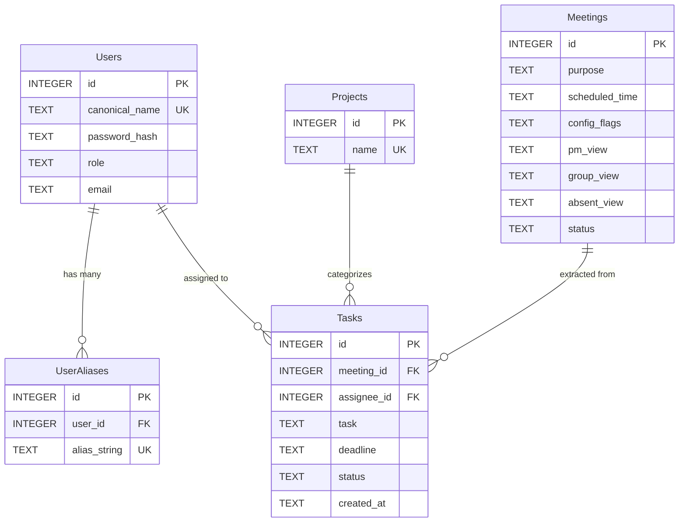

# AegisMeet: Architecture & System Blueprint (Production Source of Truth)

**SYSTEM STATUS:** Production Master Overhaul Complete (Phases 1–6 Implemented, Verified & Deployed).  
**AGENT DIRECTIVE:** This document is the absolute, definitive source of truth for the AegisMeet system. Any updates to data schemas, privacy boundaries, or API contracts must be synchronized here.

---

## 1. System Blueprint & The North Star

### Mission
Build an enterprise-grade, air-gapped, privacy-preserving AI meeting intelligence platform. AegisMeet automates meeting administration, persona-based summaries (PM View, Group View, Absentee View), and task delegation via cloud LLMs without ever leaking sensitive Personally Identifiable Information (PII) or un-anonymized attendee names to external cloud servers.

### Architectural Pivot: End-of-Meeting Batch Processing
The system decouples real-time caption scraping from immediate cloud LLM calls. Caption chunks stream into an in-memory session buffer (`MEETING_TRANSCRIPT_BUFFERS[meeting_id]`). When the meeting concludes, a single atomic trigger (`POST /end_meeting`) performs:
1. **Dynamic Normalization**: Resolves speech-to-text glitches (100 phonetic variants per name) to canonical names.
2. **Dynamic Presidio Tokenization**: Neutralizes canonical attendee names to tokens (`[PERSON_1]`, `[PERSON_2]`).
3. **Batch Cloud Reasoning**: Dispatches the complete masked transcript to Featherless AI in a single request.
4. **Local Re-hydration & Relational Persistence**: Maps tokens back to real names in volatile RAM, writes summaries (`pm_view`, `group_view`, `absent_view`, `status='completed'`) and relational tasks to SQLite.
5. **Immediate RAM Flush**: Aggressively wipes the raw transcript buffer and ephemeral PII dictionaries from RAM. Transcripts are **NEVER** persisted to SQLite.

### End-to-End Data Flow
```mermaid
flowchart TD
    subgraph Client ["Client & Meeting Intake Layer"]
        A1["Google Meet Call"] -->|Live Closed Captions| B1["Playwright Stealth Bot (Fake Media Stream Bypass)"]
        B1 -->|POST /api/intake| C1["In-Memory Session Buffer (MEETING_TRANSCRIPT_BUFFERS)"]
    end

    subgraph Trigger ["Phase 4: End-of-Meeting Trigger (POST /end_meeting)"]
        C1 -->|Full Accumulated Transcript| D1["Dynamic ASR Alias Normalizer (100 variants/name)"]
        D1 -->|Rewrites: 'Row hit' -> 'Rohith'| E1["Canonical Meeting Transcript"]
        E1 --> F1["Presidio Dynamic PatternRecognizer"]
        F1 -->|Tokenizes Canonical Attendees to [PERSON_X]| G1["Masked Transcript Block"]
        F1 -.->|Ephemeral In-Memory Map| H1["RAM PII Dictionary"]
    end

    subgraph Cloud ["Air-Gapped Cloud Boundary (Featherless AI)"]
        G1 -->|Zero-Leak Outbound Payload| I1["Cloud LLM (Qwen-2.5-72B / Llama-3-70B)"]
        I1 -->|Extracts Tasks with 'unknown' Deadlines & Granularity Rules| J1["Masked Intelligence JSON (pm_view, group_view, absent_view)"]
    end

    subgraph Persistence ["Local Rehydration, SQLite & Immediate RAM Flush"]
        J1 --> K1["Local Token Rehydration Engine"]
        H1 --> K1
        K1 -->|Rehydrated Deliverables & Summaries| L1["Structured Meeting Intelligence"]
        L1 -->|UPDATE Meetings: pm_view, group_view, absent_view, status='completed'| M1["SQLite Relational DB (tasks.db)"]
        L1 -->|INSERT INTO Tasks with resolved assignee_id| M1
        L1 -->|Immediate RAM Wipe: Buffers & PII Cleared| N1["Confirmed RAM Wipe (Zero Data Retention)"]
    end

    subgraph Presentation ["Phase 5: Next.js Multi-Page Architecture"]
        M1 -->|Strict User ID Isolation| O1["Next.js Multi-Page App Router"]
        O1 --> P1["Dashboard (/dashboard): Interactive Metric Cards & Tasks"]
        O1 --> Q1["Meetings Registry (/meetings): Clickable Purpose leading to /meetings/[id]"]
        O1 --> R1["Meeting Details (/meetings/[id]): PM View, Group View, Absentee View & Action Items"]
        O1 --> S1["Messages (/messages): Channel & DM Console with Live Dispatch"]
        O1 --> T1["Notifications (/notifications): Filtered Telemetry & Alert Center"]
        O1 --> U1["Tasks (/tasks) & Projects (/projects)"]
        O1 --> V1["Settings (/settings): Enterprise Identity & Work Profile"]
    end
```

---

## 2. Relational Database Architecture (`tasks.db`)

The SQLite database operates with strict foreign key integrity enabled on every connection (`PRAGMA foreign_keys = ON;`).



### Table Definitions & Privacy Guarantees
1. **`Users`**: Holds canonical user identities, PBKDF2/SHA-256 hashed passwords, company email addresses, and roles (`admin` or `user`).
2. **`Projects`**: Categorizes enterprise initiatives (`Workspace App`, `Auth System`, `UI Kit`, `Project A`).
3. **`Meetings`**: Stores meeting objectives, scheduled timestamps, JSON-encoded session configuration flags (`expected_participants`, `share_technical_summary`), generated summaries (`pm_view`, `group_view`, `absent_view`), and execution state (`status='scheduled' | 'completed'`). Transcripts are **NEVER** persisted to SQLite.
4. **`Tasks`**: Stores actionable deliverables linked to `meeting_id` and `assignee_id`. Strictly filtered by `assignee_id` so regular users can only access their own deliverables.
5. **`UserAliases`**: Maps foreign key `user_id` to at least 100 phonetic variations and ASR error patterns per user. Cascades on user deletion.

---

## 3. Autonomous ASR Alias Generator (100 Phonetic Variants per Name)

Automated Speech Recognition (ASR) systems frequently mishear multicultural names during live calls (e.g., `"Row hit"` for `"Rohith"`, `"May ank"` for `"Mayank"`, `"Sum bhav"` for `"Sambhav"`). AegisMeet scales error modeling to 100 variants per registered attendee:

1. **Autonomous LLM Generation (`generate_phonetic_aliases`)**:
   - Calls Featherless AI with a 6.0-second hard timeout (`asyncio.wait_for`):
     > *"You are an expert at analyzing speech-to-text engine failures. Generate a JSON array of 100 common phonetic misspellings, transcription errors, or separated syllables that automated closed captions might output when hearing the name '{canonical_name}'. Return ONLY the raw JSON array of strings."*
2. **Combinatorial Heuristic Fallback Engine (`generate_fallback_aliases`)**:
   - Generates 100+ unique, realistic phonetic variants offline covering:
     - Multi-position syllable separation with spaces and hyphens (`"Ro hith"`, `"Ro-hith"`, `"R oh ith"`).
     - Consonant substitutions (`th` $\leftrightarrow$ `t`/`d`/`te`/`ht`/`s`, `ee` $\leftrightarrow$ `i`/`ea`/`y`, `v` $\leftrightarrow$ `w`/`b`/`ff`, etc.).
     - Hallucinated ASR prefixes (`Ah`, `Uh`, `Oh`, `Al`, `El`, `De`) and suffixes (`son`, `sen`, `ton`, `man`, `ian`, `er`, `en`, `ar`).
     - Character transpositions and vowel shifts.
3. **Database Seeding & Registration Hook**:
   - On `POST /users` and initial database boot (`init_db`), each user is seeded with 100+ aliases in `UserAliases` (`Admin`: 102, `Rohith`: 116, `Mayank`: 103, `Sambhav`: 104).
4. **Pre-Masking Normalization (`normalize_transcript_aliases`)**:
   - Scans full transcripts in descending length order and rewrites all registered phonetic glitches into canonical names before passing text to Presidio.

---

## 4. End-of-Meeting Trigger, Dynamic Privacy Masking & Anti-Hallucination

1. **Batch Trigger (`POST /end_meeting`)**:
   - Retrieves the entire accumulated transcript buffer for `meeting_id` from RAM (`get_meeting_buffer`).
2. **Session-Specific Presidio Recognizer (`mask_transcript`)**:
   - Dynamically configures a `PatternRecognizer` deny-list strictly targeting the canonical names of `expected_participants`.
   - Assigns confidence `1.0`, ensuring attendee names are reliably masked to tokens (`[PERSON_1]`, `[PERSON_2]`).
3. **Side-by-Side Zero-Leak Terminal X-Ray Audit**:
   - Console logs comparison strings (`RAW:`, `NORM:`, `MASKED:`) during intake and batch processing to prove zero PII leaves the local machine.
4. **Strict Anti-Hallucination Rules (`build_system_prompt`)**:
   - **Deadline Rule**: *"Extract tasks and assign a specific date/time deadline. If not mentioned, assign the deadline strictly as 'unknown'."*
   - **Technical Granularity Rule**: *"If share_technical_summary is false, omit deeply technical architecture details from the general summaries."*
5. **Local Re-hydration & Aggressive RAM Flush**:
   - Maps tokens back to real names in volatile RAM.
   - Saves `pm_view`, `group_view`, `absent_view`, and tasks to SQLite.
   - Immediately wipes the session transcript buffer (`wipe_meeting_buffer`) and ephemeral PII RAM (`wipe_ephemeral_ram`).

---

## 5. Playwright Stealth Ingestion & Lifespan Scheduler

1. **Browser Stealth & Bypass Flags ([`backend/bot.py`](backend/bot.py))**:
   - Flags: `--use-fake-ui-for-media-stream`, `--use-fake-device-for-media-stream`, `--disable-blink-features=AutomationControlled`, `--lang=en-US`.
   - Automatically bypasses Chrome camera/mic permissions and avoids anti-bot detections.
2. **Caption Stream Ingestion**:
   - Triggers captions with `[aria-label="Turn on captions"]` (or key `'c'`).
   - Watches `aria-live` regions with a `MutationObserver` and streams text clusters to `POST /api/intake`.
3. **Lifespan APScheduler**:
   - `AsyncIOScheduler` managed inside FastAPI's `lifespan` context.
   - Accepts scheduled meetings via `POST /schedule`, registers jobs, and persists records in SQLite with `status='scheduled'`.

---

## 6. Next.js Multi-Page Frontend & Enterprise UI

1. **Strict Credential-Based JWT Authentication ([`frontend/src/lib/api.ts`](frontend/src/lib/api.ts))**:
   - Access to workspaces is strictly gated by valid username/password credentials.
   - Axios request interceptor automatically attaches `Authorization: Bearer ${token}` from `localStorage`.
   - 401 response interceptor purges expired sessions and redirects unauthenticated users to `/login`.
2. **Clickable Meetings Registry & Dynamic Routing**:
   - **`/meetings`**: Renders dark-themed "Meetings History & Registry" table strictly with columns: `"Purpose"`, `"Scheduled Time"`, `"Privacy Status"`.
   - **Clickable Purpose Link**: Clicking a meeting's purpose navigates to `/meetings/[id]`.
   - **`/meetings/[id]` Dynamic Hub**:
     - Fetches `/api/meetings/${id}`.
     - Displays session status (`Completed` / `Scheduled`), scheduled time, and air-gap badge.
     - 3 Expansive Card views: **PM View** (blockers, architecture risks, dependencies), **Group View** (core decisions, consensus points, deliverables), and **Absentee View** (comprehensive catch-up summary).
     - Action Items Table with Assignee, Deadline (`unknown` badge), and interactive status checkbox (`pending` $\leftrightarrow$ `completed`).
     - "End Meeting & Batch Process" action button for on-demand intelligence extraction.
3. **Strict Two-Party DM Isolation & Private AegisBot (`/messages`)**:
   - **Deterministic Symmetric Channel IDs**: Two-party direct messages compute a sorted key (`dm-user1-user2` where `user1 < user2` alphabetically). Regardless of who initiates the thread, both users connect to the exact same channel without crosstalk.
   - **Private User-Scoped AegisBot Streams**: AegisBot interactions are isolated per user (`dm-aegisbot-${userSlug}`), ensuring one user cannot inspect another user's bot audit trail or verification receipts.
   - **Cross-Client Live Sync**: Background polling every 3 seconds syncs incoming chats in real-time across multiple browsers without manual page reloads.
4. **Notifications & High-Contrast Design System**:
   - **`/notifications`**: Filterable alert center with category tabs (`All`, `Action Items`, `Security & Privacy`, `Scheduler & Bot`), unread counters, individual dismiss buttons, and "Mark all as read".
   - **`/dashboard`**: High-contrast grayscale dashboard with clickable metric cards routing to `/tasks`, `/projects`, and `/messages`, SVG Activity Overview graph, and Recent Tasks table with direct status toggle.
   - **Sidebar Badges**: Dynamic unread indicators matching real-time database state.

---

## 7. Complete API Specifications

| Method | Endpoint | Auth Required | Description |
| :--- | :--- | :--- | :--- |
| `GET`  | `/` | None | Root health check, version info, and Swagger documentation links |
| `GET`  | `/health` | None | Detailed server health, model status, and RAM token count |
| `POST` | `/api/login` | None | Authenticates canonical name & password; returns JWT Bearer token |
| `GET`  | `/api/me` | Bearer Token | Returns authenticated user profile and permissions |
| `POST` | `/api/users` | Admin Only | Registers new user and populates 100 phonetic aliases |
| `GET`  | `/api/users` | Admin Only | Lists registered enterprise users |
| `GET`  | `/api/tasks` | Bearer Token | Returns tasks (strictly filtered by `assignee_id` for regular users) |
| `POST` | `/api/tasks` | Bearer Token | Creates new task assigned to user or project |
| `PATCH`| `/api/tasks/{id}`| Bearer Token | Updates task completion status (`completed` / `pending`) |
| `DELETE`|`/api/tasks/{id}`| Bearer Token | Deletes task record |
| `GET`  | `/api/projects` | Bearer Token | Lists enterprise projects |
| `POST` | `/api/projects` | Bearer Token | Registers new project |
| `GET`  | `/api/meetings` | Bearer Token | Lists meetings (strictly filtered by user involvement) |
| `GET`  | `/api/meetings/{id}`| Bearer Token | Returns full meeting details, `pm_view`, `group_view`, `absent_view`, and tasks |
| `POST` | `/end_meeting` | Optional | Triggers end-of-meeting batch processing and RAM flush |
| `POST` | `/api/end_meeting` | Optional | Alias endpoint for batch processing |
| `POST` | `/meetings/{id}/end`| Optional | Alias route targeting specific meeting ID |
| `POST` | `/join` | Bearer Token | Triggers immediate Playwright bot join to Google Meet |
| `POST` | `/schedule` | Bearer Token | Schedules future meeting bot execution via APScheduler |
| `GET`  | `/api/bot/status` | Optional | Queries active bot state, duration, and captions captured |
| `POST` | `/api/bot/leave` | Optional | Disconnects and terminates active meeting bot session |
| `POST` | `/api/normalize` | Optional | Rewrites speech recognition aliases in raw transcript |
| `POST` | `/api/mask` | Optional | Returns Presidio PII tokenization preview |
| `POST` | `/api/process` | Optional | End-to-end transcript intake, masking, reasoning & rehydration |
| `GET`  | `/api/latest-result`| Optional | Fetches most recent meeting summary and extracted items |
| `GET`  | `/api/messages` | Bearer Token | Fetches messages with symmetric two-party channel isolation |
| `POST` | `/api/messages` | Bearer Token | Sends message to channel or direct message thread |
| `POST` | `/api/messages/clear`| Bearer Token | Clears chat message history |
| `GET`  | `/api/aliases` | Bearer Token | Returns registered phonetic aliases |
| `POST` | `/api/aliases/generate` | Bearer Token | On-demand generation of 100 phonetic variants for any name |
| `GET`  | `/api/audit-logs` | Optional | Verifies zero-leak outbound network telemetry |
| `GET`  | `/aegis-meet.js` | None | Serves in-tab browser caption scraper bookmarklet |

---

## 8. Verification & Quality Assurance Suite

The system is validated by **50 automated tests across 9 comprehensive test suites** executed via `pytest`:
1. `backend/test_phase1_auth.py` (9 tests): Relational tables, JWT issuance, admin restrictions, and strict user privacy filtering.
2. `backend/test_phase2_aliases.py` (6 tests): Featherless AI integration, 100-alias combinatorial fallback, auto-population, and privacy.
3. `backend/test_phase3_scheduler.py` (8 tests): Playwright stealth flags, caption selectors, mutation observers, APScheduler lifespan, and buffer accumulation.
4. `backend/test_phase4_masking_prompts.py` (7 tests): ASR alias normalization, Presidio deny-list, meeting config propagation, and strict `"unknown"` deadlines.
5. `backend/test_phase4_end_meeting.py` (3 tests): End-of-meeting trigger, batch LLM reasoning, SQLite persistence of 3 views, RAM wipes, and zero transcript retention.
6. `backend/test_pipeline.py` (5 tests): End-to-end transcript intake, normalization, PII masking, LLM parsing, and local rehydration.
7. `backend/test_bot_integration.py` (4 tests): Playwright mock meet DOM interactions, live caption ingestion, and automated browser lifecycle.
8. `backend/test_stress_full_system.py` (4 tests): High-volume transcript chunking, concurrent multi-user load, database integrity under stress, and resilience.
9. `backend/test_messaging_isolation_and_summaries.py` (4 tests): Symmetric 2-party DM channel isolation, cross-profile privacy, private AegisBot scoping, and comprehensive meeting view length checks.

- **Regression Result:** **50/50 tests passing (100% success rate)**.
- **Frontend Build:** `npm run build` compiles **12/12 routes with 0 errors** (`/meetings/[id]` server-rendered on demand).
